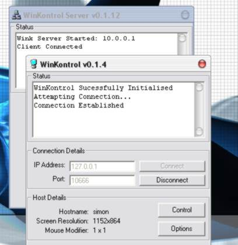



## WinKontrol

### Description

WinKontrol allows you to Control remote computers running the same software. This program allows you to control mouse movements and button clicks of remote computer system and displays a full screen image of the computer your controling. Demonstrates uses of Screen Capture, WinSock Connections, Mouse Controls, JPG image Compression. Project includes the INTEL JPG graphics Library (DLL File Included)

This program is not yet Complete. There are a few bugs and I would be extreamly gratefull if you could point them out to me, should u find them, as i'm hoping to EVENTUALLY release this as a full program.

Future updates to this program will include: Allowing both the remote computers and the connected computers mice to work independantly. The ability to send Keystrokes.. Better JPG Quality with smaller Image filesize. Faster transfers and a 'Chat' feature... More to follow...

This is my first code entry, So any votes will be greatly appreciated :)
 
### More Info
 
Future updates to this program will include: Allowing both the remote computers and the connected computers mice to work independantly. The ability to send Keystrokes.. Better JPG Quality with smaller Image filesize. Faster transfers and a 'Chat' feature... More to follow...

This program is not yet Complete. There are a few bugs and I would be extreamly gratefull if you could point them out to me, should u find them, as i'm hoping to EVENTUALLY release this as a full program

             |
---                |---
**Submitted On**   |2002-06-25 21:51:26
**By**             |[5aTaN Si](https://github.com/Planet-Source-Code/PSCIndex/blob/master/ByAuthor/5atan-si.md)
**Level**          |Advanced
**User Rating**    |4.0 (32 globes from 8 users)
**Compatibility**  |VB 5\.0, VB 6\.0
**Category**       |[Internet/ HTML](https://github.com/Planet-Source-Code/PSCIndex/blob/master/ByCategory/internet-html__1-34.md)
**World**          |[Visual Basic](https://github.com/Planet-Source-Code/PSCIndex/blob/master/ByWorld/visual-basic.md)
**Archive File**   |[WinKontrol987106252002\.zip](https://github.com/Planet-Source-Code/5atan-si-winkontrol__1-36269/archive/master.zip)

